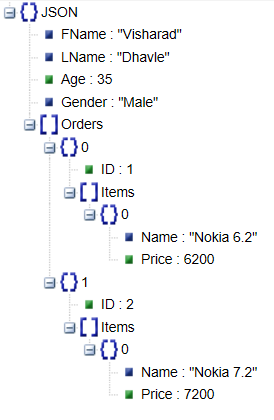

# Object Oriented Example using Go

## How to build program
Note: Go to the root of folder i.e. object-oriented
```
go build
```

## How to run program
```
go run main.go
```

## Raw output
```
{"FName":"Visharad","LName":"Dhavle","Age":35,"Gender":"Male","Orders":[{"ID":1,"Items":[{"Name":"Nokia 6.2","Price":6200}]},{"ID":2,"Items":[{"Name":"Nokia 7.2","Price":7200}]}]}
```
## [JsonViewer](http://jsonviewer.stack.hu/) Output



